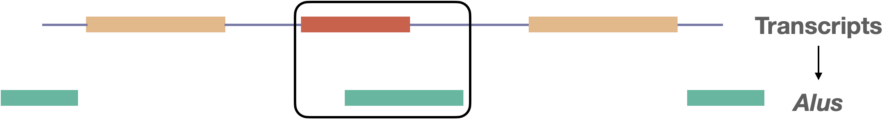
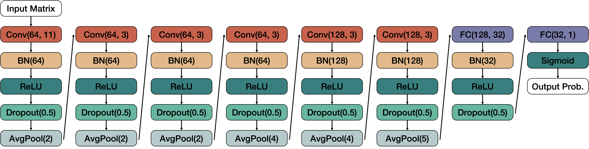

# eXAlu
A Deep Learning model to predict *Alu* exonization events in the human genome based on sequence alone.

Described in:

He Z, Chen O, Phillips N, Lui WW, Pasquesi GIM, Sabunciyan S, Florea L (2024). Predicting *Alu* exonization in the human genome with a deep learning model, [*bioRxiv*](https://www.biorxiv.org/content/10.1101/2024.01.03.574099v1) **doi:** https://doi.org/10.1101/2024.01.03.574099. *Submitted.*

```
Copyright (C) 2022-2024, and GNU GPL v3.0, by Zitong He, Liliana Florea
```

This program is free software: you can redistribute it and/or modify it under the terms of the GNU General Public License as published by the Free Software Foundation, either version 3 of the License, or (at your option) any later version.

### <a name="table-of-contents"></a> Table of contents
- [What is eXAlu?](#what-is-exalu)
- [Installation](#installation)
- [Usage](#usage)
    - [Inference mode](#inference)
    - [Mutagenesis mode (visualization)](#mutagenesis)
- [Support](#support)

### <a name="what-is-exalu"></a> What is eXAlu?
eXAlu is a Convolutional Neural Network (CNN) model that predicts the likelihood of an *Alu* repeat to be exonized based on genomic sequences.

*Alu* elements are ∼300 bp sequences belonging to an order of retrotransposons termed Short Interspersed Nuclear Elements (SINEs), found in the genomes of primates. The human genome contains more than one million copies, representing ~11% of the genome. While most *Alu* elements map to nonfunctional intergenic and intronic sequences, some become incorporated into genes. In particular, *Alu* exonization, in which an intronic *Alu* sequence is recruited into a gene transcript via splicing (see [figure](transcript_alu)), can disrupt or create gene function, potentially leading to disease. 

<!--  -->
<p align="center"><a name="transcript_alu"> </a></p>

The model takes as input a set of *Alu* elements surrounded by 350 bp context and outputs the probability for each *Alu* to undergo exonization. The model's network has six convolutional layers, batch-norm layers and pooling layers, followed by fully-connected layers that map the features extracted by the convolutional layers to the output probabilities. eXAlu was trained on human *Alu* sequences extracted from the RNA-seq data in 28 human tissues represented in the GTEx repository, as described [here](https://www.frontiersin.org/articles/10.3389/fmolb.2021.727537/full). Briefly, RNA-seq reads were aligned to the human genome with [STAR](https://github.com/alexdobin/STAR) and assembled into transcripts with [CLASS2](https://sourceforge.net/p/splicebox/wiki/CLASS/), then internal exons overlapping *Alu* annotations in antisense to the gene were extracted as *Alu* exons.

<!--  -->

This repository provides *inference* and *mutagenesis plotting* functions. The inference module implements the prediction function. The mutagenesis module produces graphs showing the difference in the model's score when mutating the input sequence, either single nucleotide changes or block deletions. 

### <a name="installation"></a> Installation
eXAlu is compatible with Linux (tested), Windows and MacOS. It requires Python 3.9+, CUDA 11.2+, and PyTorch 1.10+.

We recommend users to install and use this tool in a [conda](https://www.anaconda.com/) environment. Please follow these steps to configure the proper environment:

1. To create a conda environment and activate it:
```
conda create -n alu_env python=3.9
conda activate alu_env
```
2. Install PyTorch, scikit-learn, tensorboard, matplotlib, pybedtools, seaborn:
```
conda install pytorch torchvision cudatoolkit=11.3 -c pytorch
conda install scikit-learn tensorboard matplotlib -c conda-forge
conda install pybedtools -c bioconda
conda install seaborn -c anaconda
```
3. To install eXAlu in developing mode, enter the project root directory, then: 
```
pip install -e .
```

### <a name="usage"></a> Usage

### <a name="inference"></a> Inference
The inference module takes as input either a BED file containing the genomic *Alu* intervals, or a FASTA file containing the *Alu* plus 350 bp context sequences and, for each element, it predicts the likelihood that it can become exonized.
```
usage: run_eXAlu.py [-h] {bed,fasta} ...

positional arguments:
  {bed,fasta}  select bed or fasta input mode
    bed        infer with bed file
    fasta      infer with fasta file

optional arguments:
  -h, --help   show this help message and exit
```

To input a BED file:
```
usage: run_eXAlu.py bed [-h] -b ALU_BED_FILE -r REF_GENOME_FILE -m MODEL_WEIGHTS_FILE -o OUTPUT_DIR

optional arguments:
  -h, --help            show this help message and exit
  -b ALU_BED_FILE       the input Alu bed file
  -r REF_GENOME_FILE    the reference genome file
  -m MODEL_WEIGHTS_FILE
                        the trained model weights file
  -o OUTPUT_DIR         the directory contains temp files and final output file
```

To input a FASTA file:
```
python run_eXAlu.py fasta -f ALU_FASTA_FILE -m MODEL_WEIGHTS_FILE -o OUTPUT_DIR

optional arguments:
  -f ALU_FASTA_FILE     the input *Alu* fasta file
  -m MODEL_WEIGHTS_FILE the trained model weights file
  -o OUTPUT_DIR         the directory containing temp files and final output file, default ./out
```

#### Example
Below is an example showing inference for a small *Alu* BED file using the trained network weights:

```
conda activate alu_env
cd test/inference
python run_eXAlu.py bed -b example_alu.bed -r REF_GENOME_FILE -m ../models/model_weights.pt -o ./demo_out
python run_eXAlu.py fasta -f example_alu.fa -m ../models/model_weights.pt -o ./demo_out
```

### <a name="mutagenesis"></a> Mutagenesis
The mutagenesis module generates plots showing the effects that sequence mutations have on the model's prediction, along with annotations of peaks and, optionally, landmarks such as exon and repeat boundaries. It supports two types of mutations: single nucleotide changes and small block deletions (k=1..20 bp). For single nucleotide changes, within an *Alu* sequence and its 350 bp surrounding context regions, it mutates each base into each of the three alternate bases, plotting the difference in scores between the mutated and original sequences. For k bp block deletions, it deletes the k bp segment starting at that position. Annotations of exon boundaries, if specified, are marked with red vertical bars, and *Alu* boundaries are shown with black vertical bars. Lastly, positive and negative peaks are determined with a sliding window algorithm. Note that the peak detection algorithms have been calibrated for single base substitutions and small deletions (k<=20 bp) and may not be suitable for larger blocks.

```
python mutagenesis.py [-h] {bed,fasta} ...

positional arguments:
  {bed,fasta}  select bed or fasta input mode
    bed        infer with bed file
    fasta      infer with fasta file

optional arguments:
  -h, --help   show this help message and exit
```
Note that the BED file input contains coordinates of the *Alu* sequences only, without the 350 bp context, whereas the FASTA file input contains the *Alu* sequence plus context.

To input a BED file:
```
python mutagenesis.py bed [-h] -b ALU_BED_FILE -r REF_GENOME_FILE -m MODEL_WEIGHTS_FILE -o OUTPUT_DIR [--yaxis Y_AXIS_MODE]

optional arguments:
  -h, --help            show this help message and exit
  -b ALU_BED_FILE       the input *Alu* bed file
  -r REF_GENOME_FILE    the reference genome file
  -m MODEL_WEIGHTS_FILE
                        the trained model weights file
  -o OUTPUT_DIR         the directory contains temp files and final output file
  --yaxis Y_AXIS_MODE   limits of y-axis is fixed to +/-0.3 or adaptive. The default is fixed mode
```
Since we need the formatted description lines (start with ">") to label the sequences and plot text information within the output images, you may want to format the description lines in the FASTA input file as shown below:
```
>h38_mk_AluY::chr12:70285190-70285525(-)
```
To input a FASTA file:
```
python mutagenesis.py fasta [-h] -f ALU_FASTA_FILE -m MODEL_WEIGHTS_FILE [-o OUTPUT_DIR] [--yaxis Y_AXIS_MODE]

optional arguments:
  -h, --help            show this help message and exit
  -f ALU_FASTA_FILE     the input *Alu* fa file
  -m MODEL_WEIGHTS_FILE
                        the trained model weights file
  -o OUTPUT_DIR         the directory contains temp files and final output file, default ./out
  --yaxis Y_AXIS_MODE   limits of y-axis is fixed to +/-0.3 or adaptive. The default is fixed mode
```

The output images are created in ./demo_out/imgs/, and the text files with the score change data in ./demo_out/tables/.

#### Example
Below is an example showing how to plot the mutagenesis graphs given a BED or FASTA file input:
```
conda activate alu_env
cd test/analysis/mutagenesis
python mutagenesis.py bed -b ./example_alu.bed -r REF_GENOME_FILE -m ../../models/model_weights.pt -o ./demo_out --yaxis fixed
python mutagenesis.py fasta -f ./example_alu.fa -m ../../models/model_weights.pt -o ./demo_out --yaxis adaptive
```

### <a name="support"></a> Support
Contact: Zitong He, hezt@jhu.edu, or submit a GitHub [Issue](https://github.com/splicebox/eXAlu/issues).

## License information
See the file LICENSE for information on the history of this software, terms & conditions for usage, and a DISCLAIMER OF ALL WARRANTIES.
