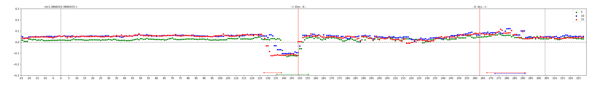

# eXAlu
A Deep Learning model to predict *Alu* exonization events in the human genome based on sequence alone.

Described in:

He Z, Lui WW, Chen O, Phillips N, Pasquesi GIM, Sabunciyan S, Florea L (2024). Predicting *Alu* exonization in the human genome with a deep learning model, [*bioRxiv*](https://www.biorxiv.org/content/10.1101/2024.01.03.574099v1) **doi:** https://doi.org/10.1101/2024.01.03.574099. *Submitted.* [[Supporting data](http://ccb.jhu.edu/software/eXAlu/)]

```
Copyright (C) 2022-2024, and GNU GPL v3.0, by Zitong He, Liliana Florea
```

This program is free software: you can redistribute it and/or modify it under the terms of the GNU General Public License as published by the Free Software Foundation, either version 3 of the License, or (at your option) any later version.

### <a name="table-of-contents"></a> Table of contents
- [What is eXAlu?](#what-is-exalu)
- [Installation](#installation)
- [Usage](#usage)
    - [Inference mode](#inference)
    - [Mutagenesis mode (visualization)](#mutagenesis)
- [Support](#support)

## <a name="what-is-exalu"></a> What is eXAlu?
eXAlu is a Convolutional Neural Network (CNN) model that predicts the likelihood of an *Alu* repeat to be exonized based on genomic sequences.

*Alu* elements are ∼300 bp sequences belonging to an order of retrotransposons termed Short Interspersed Nuclear Elements (SINEs), found in the genomes of primates. The human genome contains more than one million copies, representing ~11% of the genome. While most *Alu* elements map to nonfunctional intergenic and intronic sequences, some become incorporated into genes. In particular, *Alu* *exonization*, in which an intronic *Alu* sequence is recruited into a gene transcript via splicing (see [figure](#transcript_alu)), can disrupt or create gene function, potentially leading to disease. 

<!--  -->
<a name="transcript_alu"></a>
<p align="center"><a name="transcript_alu"> </a></p>

The model takes as input an *Alu* element surrounded by 350 bp sequence context and outputs the probability for the *Alu* to undergo exonization. The model's network has six convolutional layers, batch-norm layers and pooling layers, followed by fully-connected layers that map the features extracted by the convolutional layers to the output probabilities. The output is a probability score labeled as follows: the *Alu* is deemed ‘exonized’ iff (score>=0.5). eXAlu was trained on human *Alu* sequences extracted from the RNA-seq data in 28 human tissues represented in the GTEx repository. Briefly, RNA-seq reads were aligned to the human genome with [STAR](https://github.com/alexdobin/STAR) and assembled into transcripts with [CLASS2](https://sourceforge.net/p/splicebox/wiki/CLASS/), then internal exons overlapping *Alu* annotations in antisense to the gene were extracted as *Alu* exons.

<!--  -->

This repository provides *inference* and *mutagenesis plotting* functions. The *inference* module implements the prediction function. The *mutagenesis* module produces graphs showing the difference in the model's score when mutating the input sequence, either single nucleotide changes or block deletions. Upon user request, graphs are annotated with peaks, which point to features important for recognition and potentially for the exonization process, such as splicing regulatory signals. Negative peaks mark changes in the local sequence that reduce the likelihood of exonization, and positive peaks mark changes leading to an increased probability.  

## <a name="installation"></a> Installation
eXAlu is compatible with Linux (tested), Windows and MacOS. It requires Python 3.9+, CUDA 11.2+, and PyTorch 1.10+.

We recommend users to install and use this tool in a [conda](https://www.anaconda.com/) environment. Please follow these steps to configure the proper environment:

1. To create a conda environment and activate it:
```
conda create -n alu_env python=3.9
conda activate alu_env
```
2. Install PyTorch, scikit-learn, tensorboard, matplotlib, pybedtools, seaborn:
```
conda install pytorch torchvision cudatoolkit=11.3 -c pytorch
conda install scikit-learn tensorboard matplotlib -c conda-forge
pip install torch torchvision torchaudio 
pip install pybedtools
```
3. To install eXAlu in developing mode, enter the project root directory, then: 
```
pip install -e .
```

## <a name="usage"></a> Usage

### <a name="inference"></a> Inference
The *inference* module takes as input either a BED file containing the genomic *Alu* intervals, or a FASTA file containing the *Alu* plus 350 bp context sequences and, for each element, it predicts the likelihood that it can become exonized.
```
usage: run_eXAlu.py [-h] {bed,fasta} ...

positional arguments:
  {bed,fasta}  select bed or fasta input mode
    bed        infer with bed file
    fasta      infer with fasta file

optional arguments:
  -h, --help   show this help message and exit
```

To input a BED file:
```
usage: run_eXAlu.py bed [-h] -b ALU_BED_FILE -r REF_GENOME_FILE -m MODEL_WEIGHTS_FILE -o OUTPUT_DIR

optional arguments:
  -h, --help            show this help message and exit
  -b ALU_BED_FILE       the input Alu bed file
  -r REF_GENOME_FILE    the reference genome file
  -m MODEL_WEIGHTS_FILE
                        the trained model weights file
  -o OUTPUT_DIR         the directory contains temp files and final output file
```

To input a FASTA file:
```
python run_eXAlu.py fasta -f ALU_FASTA_FILE -m MODEL_WEIGHTS_FILE -o OUTPUT_DIR

optional arguments:
  -f ALU_FASTA_FILE     the input Alu fasta file
  -m MODEL_WEIGHTS_FILE the trained model weights file
  -o OUTPUT_DIR         the directory containing temp files and final output file, default ./out
```
#### Output
The output is formatted as follows:
```
7.568726232420886e-06   3.0     h38_mk_AluY_1_bothfix_0_0_NA::chr1:8388281-8388653(-)
6.5665931288094725e-06  3.0     h38_mk_AluSc_2_bothfix_0_0_NA::chr1:33554151-33554518(-)
7.541426384705119e-06   3.0     h38_mk_AluY_3_bothfix_0_0_NA::chr1:41942860-41943240(-)
```
where column 1 is the predicted eXAlu score, column 2 is a placeholder, and column 3 describes the *Alu* element, including *Alu* name, index in the file and location and strand on the genome.

#### Example
Below is an example showing inference for a small *Alu* BED file using the trained network weights:

```
conda activate alu_env
cd test/inference
python run_eXAlu.py bed -b example_alu.bed -r REF_GENOME_FILE -m ../models/model_weights.pt -o ./demo_out
python run_eXAlu.py fasta -f example_alu.fa -m ../models/model_weights.pt -o ./demo_out
```

### <a name="mutagenesis"></a> Mutagenesis
The *mutagenesis* module generates plots showing the effects that sequence mutations have on the model's prediction, along with annotations of peaks and landmarks such as exon and repeat boundaries. It supports two types of mutations: single nucleotide changes and small block deletions (k=1..30 bp). For single nucleotide changes, within an *Alu* sequence and its 350 bp surrounding regions, it mutates each base into each of the three alternate bases, plotting the difference in scores between the mutated and original sequences. For k bp block deletions, it deletes the k bp segment starting at that position. Annotations of exon boundaries, if specified, are marked with red vertical bars, and *Alu* boundaries are shown with black vertical bars (see [figure](#mutagenesis_plot)). Lastly, positive and negative peaks are determined with a sliding window algorithm and marked with horizontal bars along the sequence interval. Note that the peak detection algorithms have been calibrated for single base substitutions and small deletions (k<=15 bp) and may not be suitable for larger blocks.

<a name="mutagenesis_plot"></a>
<p align="center"><a name="mutagenesis_plot"> </a></p>

To generate a mutagenesis plot:
```
usage: run_mutagenesis.py [-h] {bed,fasta} ...

positional arguments:
  {bed,fasta}  select bed or fasta input mode
    bed        infer with bed file
    fasta      infer with fasta file

optional arguments:
  -h, --help   show this help message and exit
```

To input a BED file:
```
usage: run_mutagenesis.py bed [-h] -t TYPE [-k K_BP_DELETION_LIST] [-p] -b ALU_BED_FILE -r REF_GENOME_FILE -m MODEL_WEIGHTS_FILE -o OUTPUT_DIR [--yaxis Y_AXIS_MODE] [--no-alu-boundaries]

optional arguments:
  -h, --help            show this help message and exit
  -t TYPE               the type of mutagenesis plot, please choose from substitution or deletion, -k is required when the type is deletion
  -k K_BP_DELETION_LIST
                        a comma-separated list of integers (1 to 4 elements, each between 1 and 30) specifying the number of deleting bases for deletion mutagenesis plot
  -p                    draw peaks on plot and output peaks file
  -b ALU_BED_FILE       the input Alu bed file
  -r REF_GENOME_FILE    the reference genome file
  -m MODEL_WEIGHTS_FILE
                        the trained model weights file
  -o OUTPUT_DIR         the directory contains temp files and final output file
  --yaxis Y_AXIS_MODE   limits of y-axis is fixed to +/-0.3 or adaptive, the default is fixed mode
  --no-alu-boundaries   Do not draw Alu boundaries (grey vertical dashed lines) on plot
```

To input a FASTA file:
```
usage: run_mutagenesis.py fasta [-h] -t TYPE [-k K_BP_DELETION_LIST] [-p] -f ALU_FASTA_FILE -m MODEL_WEIGHTS_FILE [-o OUTPUT_DIR] [--yaxis Y_AXIS_MODE] [--no-alu-boundaries]

optional arguments:
  -h, --help            show this help message and exit
  -t TYPE               the type of mutagenesis plot, please choose from substitution or deletion, -k is required when the type is deletion
  -k K_BP_DELETION_LIST
                        a comma-separated list of integers (1 to 4 elements, each between 1 and 30) specifying the number of deleting bases for deletion mutagenesis plot
  -p                    draw peaks on plot and output peaks file
  -f ALU_FASTA_FILE     the input Alu fa file
  -m MODEL_WEIGHTS_FILE
                        the trained model weights file
  -o OUTPUT_DIR         the directory contains temp files and final output file, default ./out
  --yaxis Y_AXIS_MODE   limits of y-axis is fixed to +/-0.3 or adaptive, the default is fixed mode
  --no-alu-boundaries   Do not draw Alu boundaries (grey vertical dashed lines) on plot
```

The *output images* are created in OUTPUT_DIR/imgs/, the text files with the ** data in OUTPUT_DIR/tables/, and the *peak* files in OUTPUT_DIR/peaks/ .

#### Input/Output 

1. Note that *the BED file input* must contain the coordinates of the *Alu* sequence, without flanks, whereas *the FASTA file input* must include sequences of the *Alu* and the surrounding 350 bp regions. 

2. The current version of the program requires the following *standard format* for the FASTA header lines. This information is also plotted on the generated PNG images.

```
>ANY_INFO::ANY_CHR:START-END(ANY_STRAND)
```
where:
- `ANY_INFO`: Identifier or additional details.
- `ANY_CHR`: Chromosome name.
- `START` and `END`: Genomic coordinates (ensure `END - START` equals the length of the *Alu* element).
- `ANY_STRAND`: DNA strand (`+` for forward, `-` for reverse).

Example: `>h38_mk_AluJb::chr19:1517005-1518036(-)`. A placeholder, such as `>localID::chr1:0-1200(.)`, can be used if the location data is not available, with the following requirements: *i)* the (full) header is a unique identifier for the sequence in the FASTA file; *ii)* 'localID' must not contain '::'; *iii)* currently, a chromosome name is required for the region (e.g., 'chr1'); and *iv)* the length of the region, such as 1200-0 (=1200), must be equal to the actual length of the sequence. 

3. **Alu* boundaries marking.* For BED file inputs, the program automatically marks the *Alu* boundaries using coordinates from the ALU_BED_FILE. For FASTA file inputs, it marks the endpoints of the 350 bp flanking regions. Using the `--no-alu-boundaries` option will leave the boundaries unmarked.

#### Example
Below is an example showing how to plot the mutagenesis graphs given a BED or FASTA file input:
```
conda activate alu_env
cd test/analysis/mutagenesis
python run_mutagenesis.py bed -t substitution -b ./example_alu.bed -r REF_GENOME_FILE -m ../../models/model_weights.pt -o ./demo_out --yaxis fixed
python run_mutagenesis.py fasta -t substitution -f ./example_alu.fa -m ../../models/model_weights.pt -o ./demo_out --yaxis adaptive -p
python run_mutagenesis.py bed -t deletion -k 5,10,15 -b ./example_alu.bed -r REF_GENOME_FILE -m ../../models/model_weights.pt -o ./demo_out --yaxis fixed -p
python run_mutagenesis.py fasta -t deletion -k 1,6,11,16 -f ./example_alu.fa -m ../../models/model_weights.pt -o ./demo_out --yaxis fixed -p --no-alu-boundaries
```

## <a name="support"></a> Support
Contact: Zitong He, hezt@jhu.edu, or submit a GitHub [Issue](https://github.com/splicebox/eXAlu/issues).

## License information
See the file LICENSE for information on the history of this software, terms & conditions for usage, and a DISCLAIMER OF ALL WARRANTIES.
